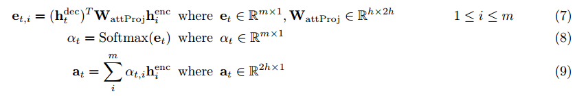

# Neual Machine Translation
### Bidirectional LSTM with Multiplicative Attention   

### 1. Summary
Neural Machine Translation is to convert a sentence from the source language (e.g. French) to the target language (e.g. English). In this assignment, we will implement a sequence-to-sequence (Seq2Seq) network with attention, to build a Neural Machine Translation (NMT) system. In this section, we describe the training procedure for the proposed NMT system, which uses a Bidirectional LSTM Encoder and a Unidirectional LSTM Decoder.

### 2. Network Architecture

### 3. Model
- Encoder : Hidden State and Cell State

- Decoder : Hidden State and Cell State
  - Initialize the Decoder's first hidden state and Cell State. (Bidirectional: shape is 2*hidden_size)
  
  
  - On time-stamp t, Decoder's Hidden State and Cell State
  
  
- Multiplicative Attention

- Output Vector 
concatenate the attention output at with the decoder hidden state hdect and pass this through a linear layer, Tanh, and Dropout to attain the combined-output vector ot.  

- Probability distribution Pt over target words at the time-stamp t

### 4. Metric

BLEU (bilingual evaluation understudy) is an algorithm for evaluating the quality of text which has been machine-translated from one natural language to another. Quality is considered to be the correspondence between a machine's output and that of a human: "the closer a machine translation is to a professional human translation, the better it is" – this is the central idea behind BLEU. BLEU was one of the first metrics to claim a high correlation with human judgements of quality, and remains one of the most popular automated and inexpensive metrics.

Scores are calculated for individual translated segments—generally sentences—by comparing them with a set of good quality reference translations. Those scores are then averaged over the whole corpus to reach an estimate of the translation's overall quality. Intelligibility or grammatical correctness are not taken into account.

### 5. Model Training

- Local Training   
  **sh run.sh train_local**

- GPU Training   
  - pip install -r gpu_requirements.txt
  - sh run.sh train 
  
### 6. Test and Evaluation   
  - sh run.sh test
  - python evaluation output.py 
