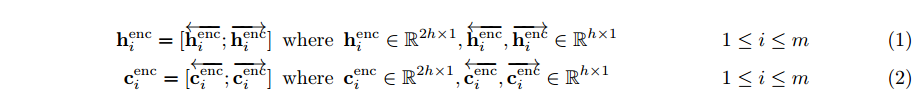
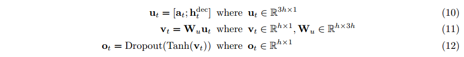

# Neual-Machine-Translation
### Bidirectional LSTM with Multiplicative Attention   

### 1. Summary
Neural Machine Translation is to convert a sentence from the source language (e.g. French) to the target language (e.g. English). In this assignment, we will implement a sequence-to-sequence (Seq2Seq) network with attention, to build a Neural Machine Translation (NMT) system. In this section, we describe the training procedure for the proposed NMT system, which uses a Bidirectional LSTM Encoder and a Unidirectional LSTM Decoder.

### 2. Network Architecture

### 3. Model
- Encoder : Hidden State and Cell State

- Decoder : Hidden State and Cell State
  - Initialize the Decoder's first hidden state and Cell State. (Bidirectional: shape is 2*hidden_size)
  
  
  - On time-stamp t, Decoder's Hidden State and Cell State
  
  
- Multiplicative Attention

- Output Vector 
concatenate the attention output at with the decoder hidden state hdect and pass this through a linear layer, Tanh, and Dropout to attain the combined-output vector ot.  

- Probability distribution Pt over target words at the time-stamp t

